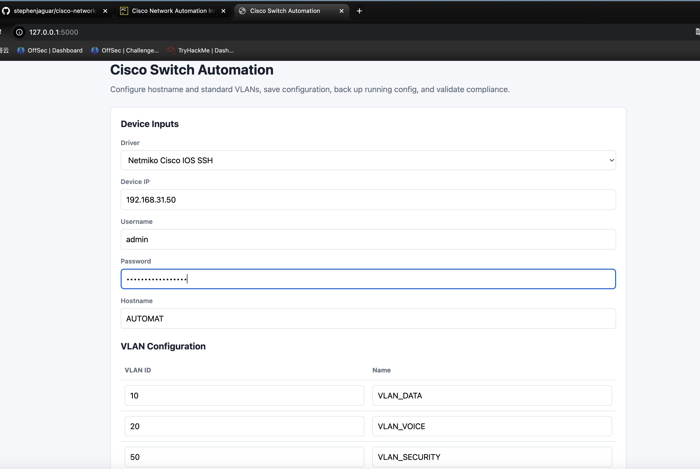
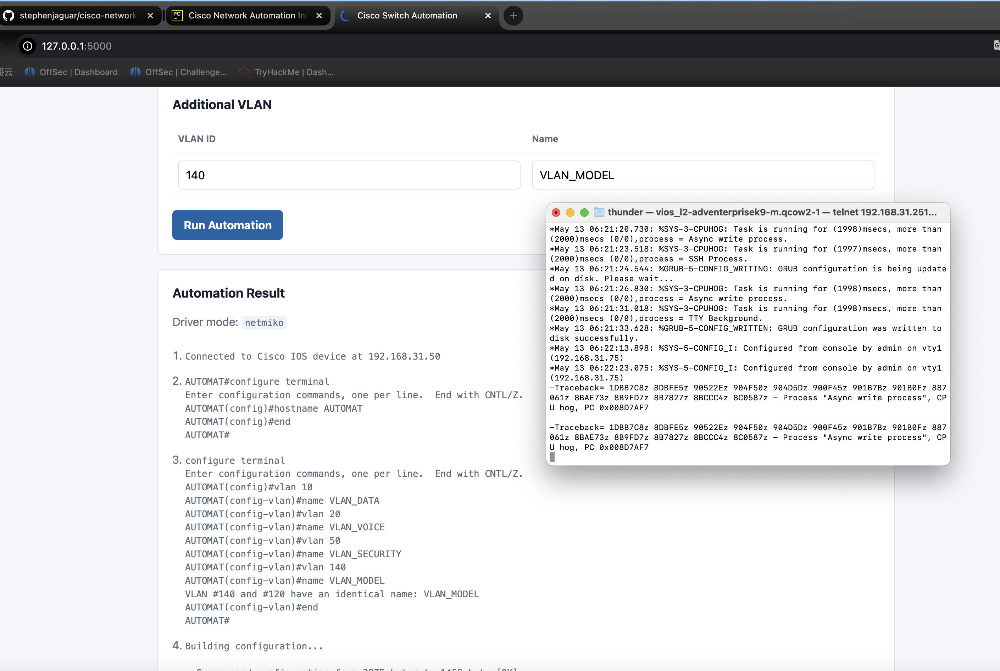
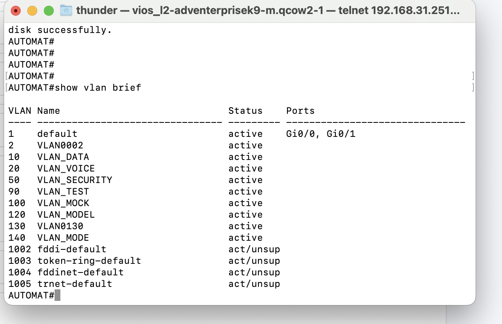
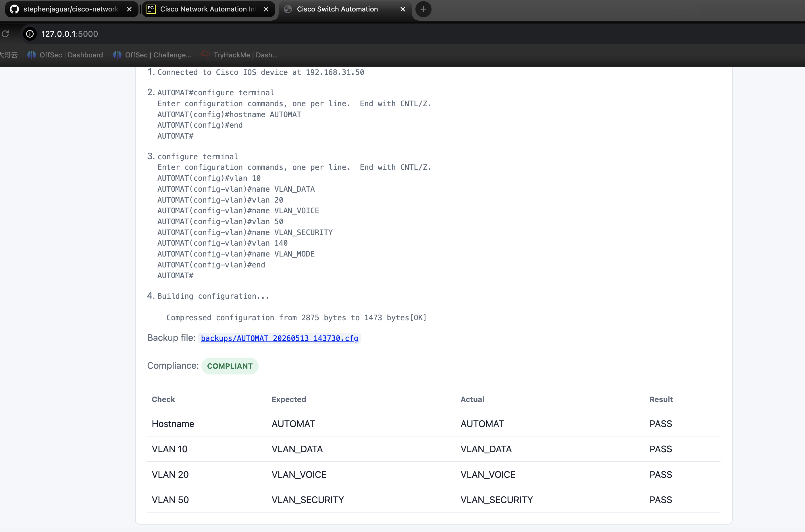
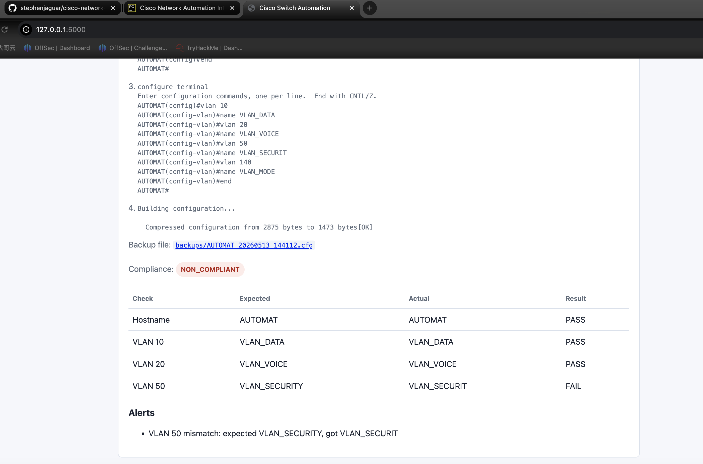
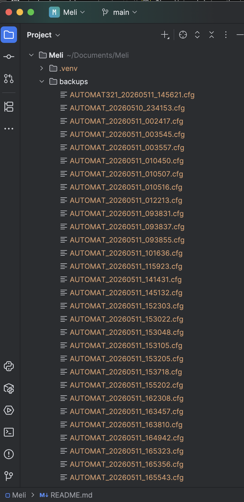

# Part 1 Screenshots

## Screenshot 1

Evidence that the frontend works.

## Screenshot 2

Evidence of the configuration performed on the switch.

## Screenshot 3

Screenshots from the switch CLI.

## Screenshot 4

Evidence of validation execution and alerts.

## Screenshot 5

Evidence of compliance check.

## Screenshot 6

The configuration backup file in the repository.

